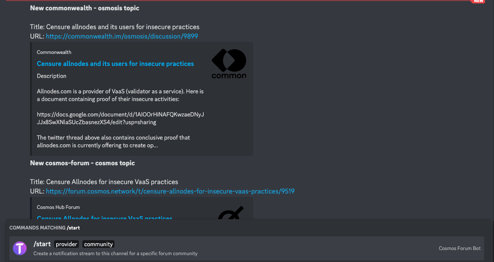

# Cosmos Forum(s) Bot

This is a bot that will help you track forum proposals. You can use our own self-hosted bots and host your bot yourself.

Discord bot: https://discord.com/api/oauth2/authorize?client_id=1070792565990895737&permissions=277025458240&scope=bot

Telegram bot: https://t.me/CosmosForumBot

## How it works

It basically reads from a specific forum/endpoint and adds the last topics to a database
and keep checking for newer topics. If it finds a new topic, it will send a message to 
a specific channel.

We have decided to use in-local sqlite to reduce the infra needed and since was a simple use-case.
If there is a need we will replace it with a more robust solution

## Current forums

| Forum        | Communities                                              |
|--------------|----------------------------------------------------------|
| cosmos-forum | cosmos                                                   |
| mars-forum   | mars                                                     |
| commonwealth | osmosis, stargaze, juno, evmos, chihuahua, bitsong-forum |

### How to add more?

Open an issue on github (https://github.com/TedcryptoOrg/cosmos-forums-bot/issues) asking for your community to be added.
For commonwealth, feel free to add a PR adding the community slug to the allowed community list (it is hardcoded in the commonwealth provider)

## How to use

### Initial setup

```shell
# Copy the .env file
cp .env.dist .env

# Install ts-node globally if you didn't
npm install -g ts-node

# Install dependencies
npm install
```

### Telegram

With telegram you can create a bot first by talking to @BotFather. Grab your bot token and add
it to your .env file.

### Discord

You need to provide the client id and the bot token, you can create your own bot from the developer portal on discord (https://discord.com/developers/applications)

### Run bot

```shell
# Run the bot
ts-node src/index.ts
```

### Example in Images


(Bot logs)


(Bot running on telegram)


(Bot running on discord)
