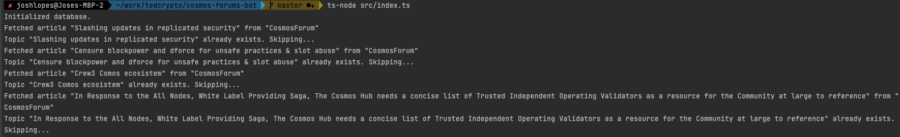
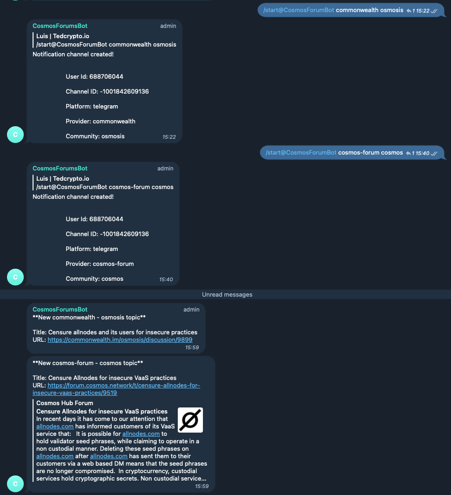

# CosmosForum Forum Bot

This is a bot that will help you to track forum proposals

## How to use

### Initial setup

```shell
# Copy the .env file
cp .env.dist .env

# Install ts-node globally if you didn't
npm install -g ts-node

# Install dependencies
npm install
```

### Telegram

With telegram you can create a bot first by talking to @BotFather. Grab your bot token and add
it to your .env file.

### Run bot

```shell
# Run the bot
ts-node src/index.ts
```

## How it works

It basically reads from a specific forum/endpoint and adds the last topics to a database
and keep checking for newer topics. If it finds a new topic, it will send a message to 
a specific channel, currently only telegram.


(Bot logs)


(Bot running on telegram)